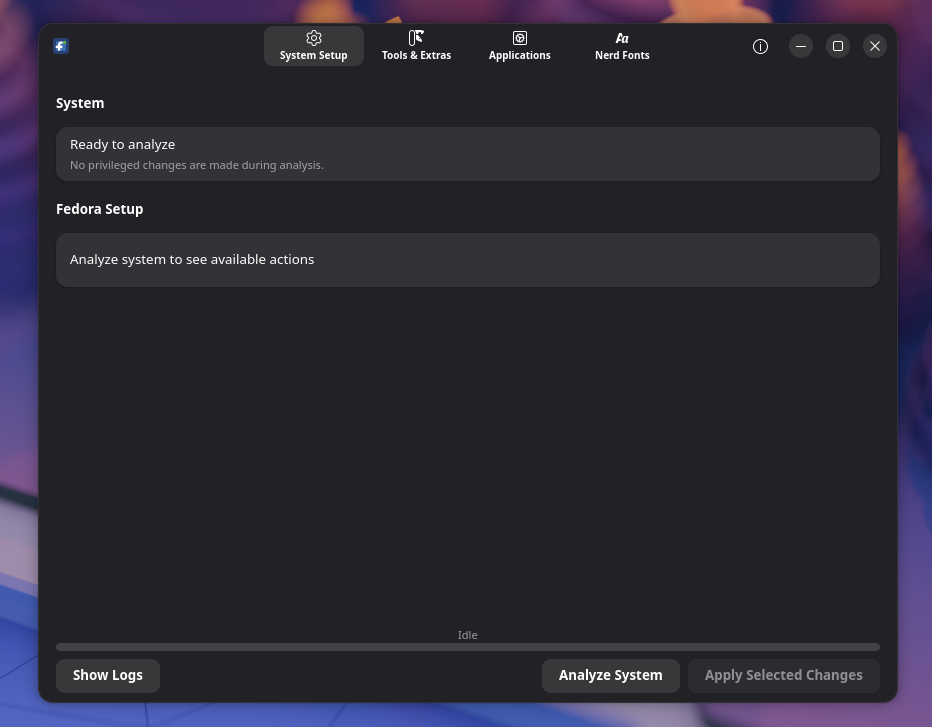
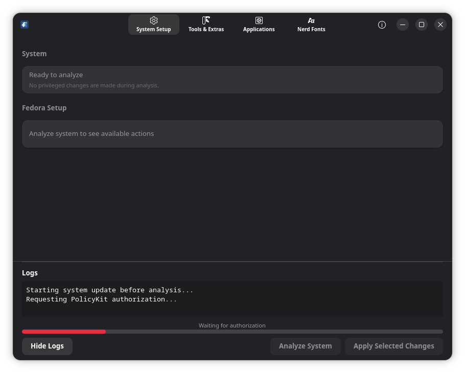
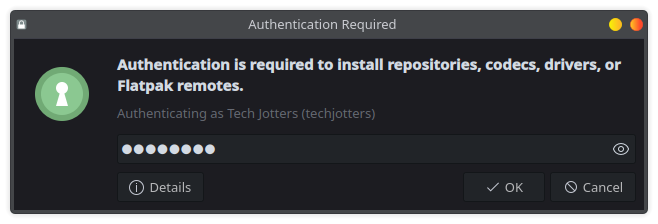
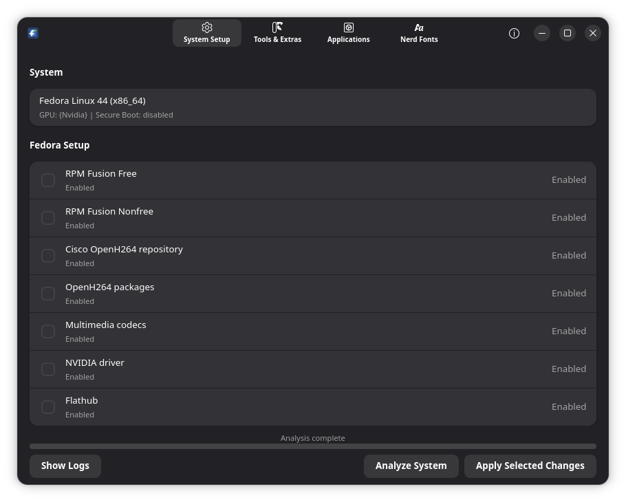
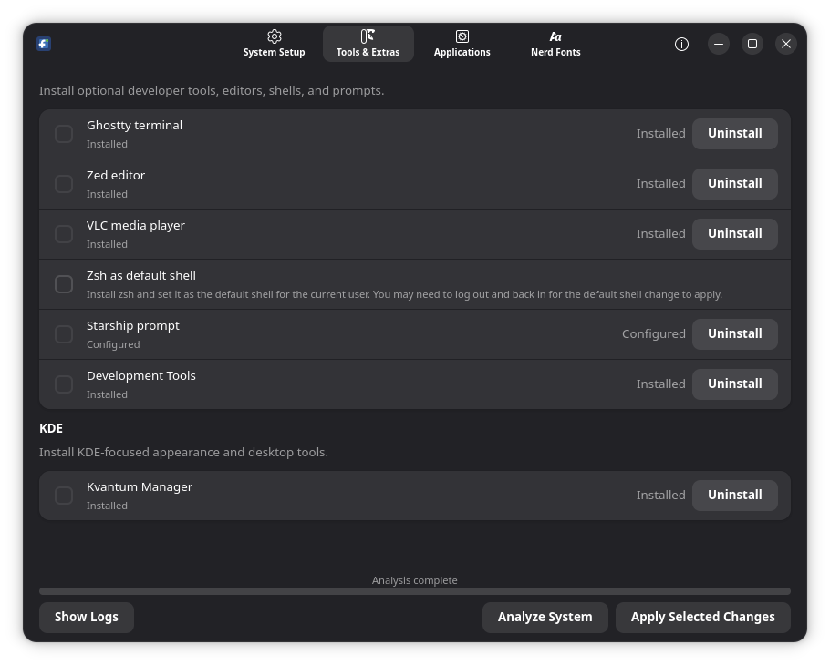
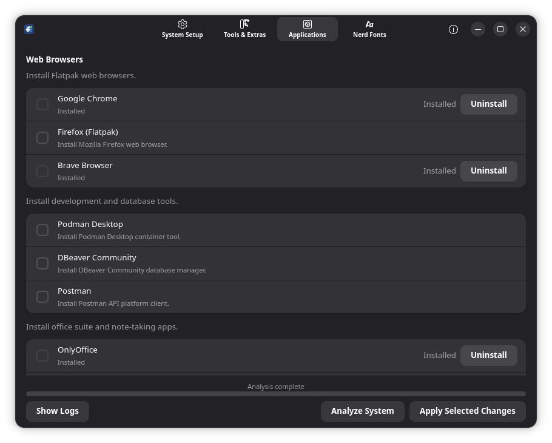
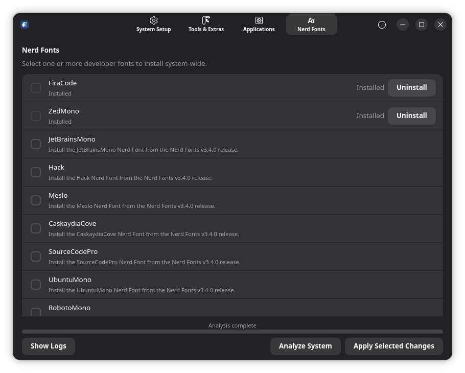

<!-- Developed by mahbub khan <mahbub.aumi@gmail.com> -->

# Postora

Postora is a native Fedora desktop utility for common post-install setup tasks.
It checks the system first, then lets you apply selected repository, codec,
driver, Flatpak, shell, font, and application changes through PolicyKit.



## Download

The latest release package is included in this repository:

[postora-0.1.6-1.fc44.x86_64.rpm](postora-0.1.6-1.fc44.x86_64.rpm)

Install it on Fedora with:

```sh
sudo dnf install ./postora-0.1.6-1.fc44.x86_64.rpm
```

## Screenshots













## Details

- Fedora-focused GTK4/libadwaita desktop app.
- System analysis runs before privileged changes.
- PolicyKit is used for installation tasks.
- Includes the latest RPM release file for direct installation.
